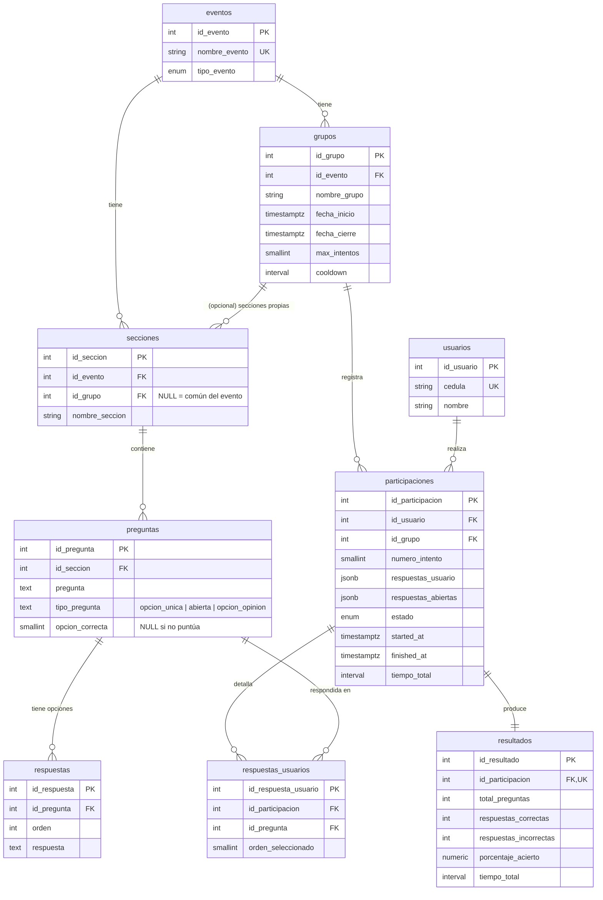

# Modelo de datos — Trivia API

Documento de referencia del esquema de base de datos (`schema` PostgreSQL: `trivia`).
Stack: PostgreSQL + SQLAlchemy 2.0 (async) + Alembic.

## Diagrama entidad-relación



## Cadenas de relación

- **Contenido (preguntas):** `eventos → secciones → preguntas → respuestas`
- **Participación:** `eventos → grupos → participaciones ← usuarios`
- **Resultado:** `participaciones → resultados` (1:1) y `participaciones → respuestas_usuarios → preguntas`

## Cómo cumple los requisitos funcionales

| Requisito | Implementación |
|-----------|----------------|
| Varios eventos | tabla `eventos` |
| Varios grupos por evento | `grupos.id_evento` |
| Usuarios en eventos | `usuarios` + `participaciones → grupos → eventos` |
| Preguntas por evento **y** por grupo (mixto) | `secciones.id_grupo` (ver abajo) |

## Modelo "mixto" de preguntas (secciones comunes vs por grupo)

Las preguntas cuelgan de una **sección**, y la sección define su alcance mediante `id_grupo`:

- `secciones.id_grupo IS NULL` → **sección común del evento**: la ven todos los grupos.
- `secciones.id_grupo = X` → **sección específica del grupo X**: solo la ve ese grupo.

Las preguntas que ve un usuario del grupo `X` en el evento `Y`:

```sql
SELECT p.*
FROM trivia.preguntas p
JOIN trivia.secciones s ON s.id_seccion = p.id_seccion
WHERE s.id_evento = :Y
  AND (s.id_grupo IS NULL OR s.id_grupo = :X);
```

### Integridad evento ↔ grupo

`secciones` guarda `id_evento` (siempre) e `id_grupo` (opcional). Como un grupo ya
pertenece a un evento, esto introduce una redundancia controlada. Para evitar
inconsistencias (que el `id_evento` de la sección no coincida con el evento del grupo)
se usa un **FK compuesto**:

- `grupos` tiene `UNIQUE(id_evento, id_grupo)`.
- `secciones` tiene `FOREIGN KEY (id_evento, id_grupo) → grupos(id_evento, id_grupo)`.

Cuando `id_grupo` es NULL el FK compuesto no se evalúa (MATCH SIMPLE), por lo que las
secciones comunes solo dependen de `id_evento → eventos`.

### Unicidad de nombres de sección

Índices únicos parciales (para manejar el NULL correctamente):

- `uq_seccion_evento_comun`: `UNIQUE(id_evento, nombre_seccion) WHERE id_grupo IS NULL`
- `uq_seccion_evento_grupo`: `UNIQUE(id_evento, id_grupo, nombre_seccion) WHERE id_grupo IS NOT NULL`

## Tipos de pregunta (`preguntas.tipo_pregunta`)

| Tipo | Opciones | `opcion_correcta` | ¿Puntúa? | Uso |
|------|----------|-------------------|----------|-----|
| `opcion_unica` | 1–4 respuestas | requerida (orden de la correcta) | Sí | Pregunta de conocimiento |
| `abierta` | sin respuestas | NULL | No | Texto libre (se guarda en `respuestas_abiertas`) |
| `opcion_opinion` | 1–4 respuestas | NULL | No | Encuesta/opinión (cualquier opción válida; se registra la elegida) |

El puntaje (`calcular_resultado`) solo cuenta preguntas con `opcion_correcta` no nula,
por lo que `abierta` y `opcion_opinion` quedan excluidas automáticamente.

## Notas de normalización

- El esquema está en ~3FN. FKs con `ON DELETE CASCADE` y constraints únicos sensatos.
- `secciones.id_evento` + `id_grupo`: redundancia controlada con FK compuesto (ver arriba).
- **`participaciones.respuestas_usuario` (JSONB)** coexiste con la tabla normalizada
  **`respuestas_usuarios`**. Es una duplicación deliberada (snapshot JSONB vs detalle
  consultable). Conviene tratar `respuestas_usuarios` como fuente de verdad para reportes.
- `respuestas_abiertas` (y las de opinión) se guardan como JSONB; si se requiere análisis
  por query conviene normalizarlas a futuro.
- `opcion_correcta` se guarda como `orden` (no FK a `respuestas`); aceptable por el
  `UNIQUE(id_pregunta, orden)`.
